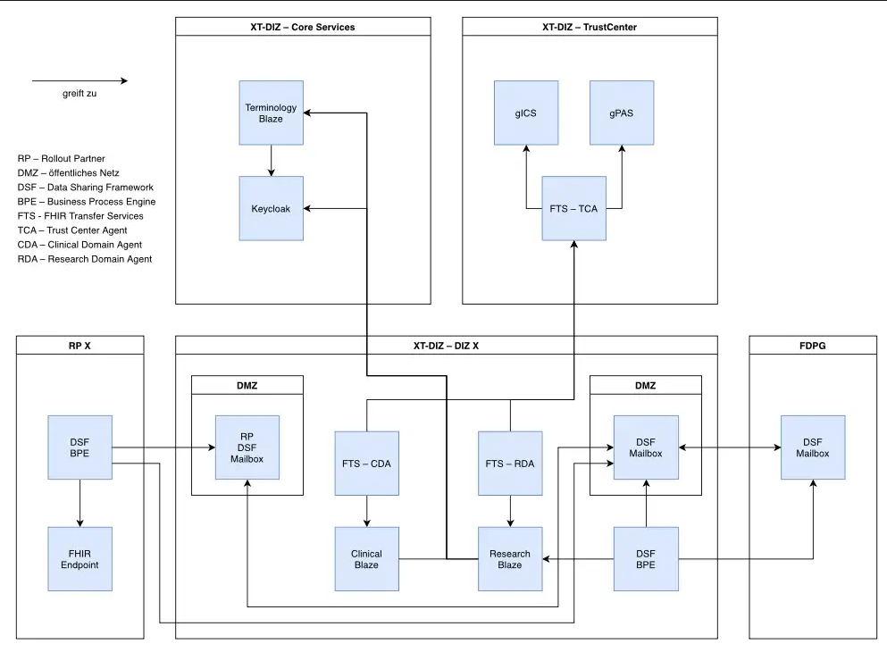

# DISTANCE:PRO XT — Data Integration Center (DIZ)

Per-site application deployed once for each rollout partner in the DISTANCE:PRO XT network.

## Introduction

Each rollout partner gets its own DIZ instance. The DIZ manages the full lifecycle of clinical research data:
ingestion into a clinical FHIR store, pseudonymization via the shared trust center, and storage of de-identified data in
a separate research FHIR store. Cross-site communication happens through the DSF (Data Sharing Framework) messaging
layer.

## Services

| Service                      | Technology                                                           | Role                                                                    |
|------------------------------|----------------------------------------------------------------------|-------------------------------------------------------------------------|
| Clinical Domain FHIR Store   | [Blaze](https://github.com/samply/blaze)                             | Stores original clinical FHIR data, with web frontend                   |
| Research Domain FHIR Store   | [Blaze](https://github.com/samply/blaze)                             | Stores pseudonymized research data, with web frontend                   |
| Clinical Domain Agent        | [FTS-next](https://github.com/medizininformatik-initiative/fts-next) | Reads clinical data, coordinates pseudonymization with the trust center |
| Research Domain Agent        | [FTS-next](https://github.com/medizininformatik-initiative/fts-next) | Receives and stores pseudonymized data                                  |
| FDPG Mailbox                 | [DSF FHIR Server](https://github.com/datasharingframework)           | Externally reachable endpoint for cross-site FHIR messaging             |
| FDPG Business Process Engine | [DSF BPE](https://github.com/datasharingframework)                   | Workflow coordination for multi-site processes                          |
| Rollout Partner Mailbox      | DSF FHIR Server                                                      | Internal message exchange with the rollout partner                      |

## Data Flow

1. Clinical data is loaded into the **Clinical Domain FHIR Store**
2. The **Clinical Domain Agent** extracts data and coordinates with the trust center for consent checks and
   pseudonymization
3. Pseudonymized data is delivered to the **Research Domain Agent**
4. The agent stores de-identified records in the **Research Domain FHIR Store**
5. Cross-site queries and data sharing happen through the **DSF** messaging layer (FDPG Mailbox + BPE)

## Multi-Site Deployment

One instance of this repository is deployed per rollout partner. Site-specific configuration (hostnames,
secrets) is injected at deployment time via CI/CD variables.

## Architecture Context

This is one of three repositories that make up the DISTANCE:PRO XT platform:

- **[core](../core)** — Shared terminology and authentication services
- **[trust-center](../trust-center)** — Consent management and pseudonymization
- **diz** (this repo) — Per-site data integration (one instance per rollout partner)
